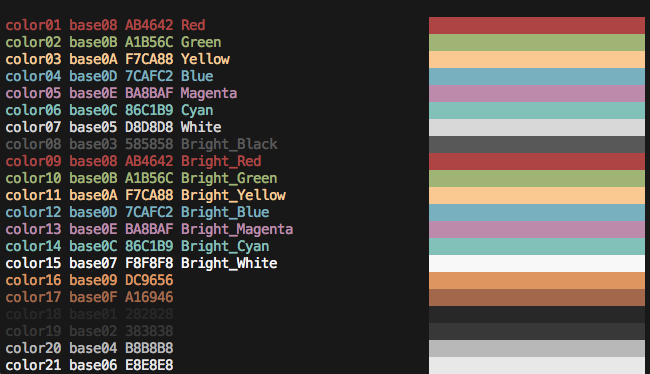

> A regenerative base16 repository for shell and neovim

# Base16 Shell

## Use Cases

* You want to use a `*.256.*` variant of a Terminal theme designed to honor the
  original bright colors.
* You prefer to use a script instead of a terminal emulator theme to color your
  shell.
* You use this script to have different colorschemes appear on different SSH
  sessions.

# Base16 Neovim

